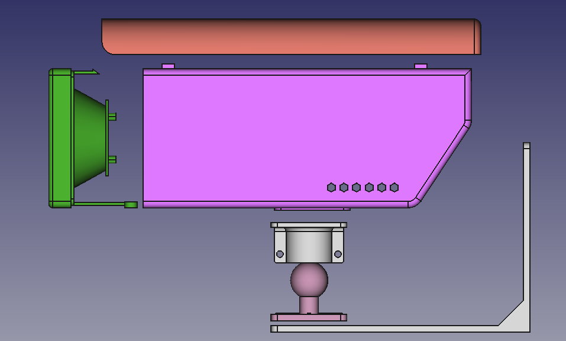
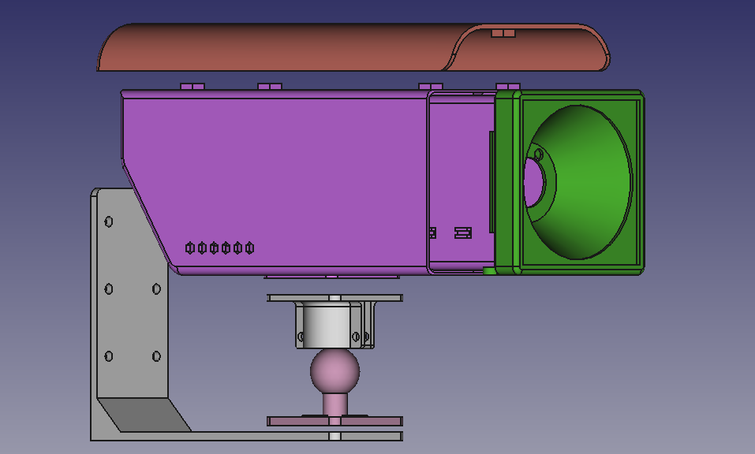

### Modelos 3D para prototipo de cámara

Este repositorio hace parte del proyecto de investigación para la construcción de un [sistema de conteo de vehícular](https://appmapy.facitec.edu.py/about). Contiene modelos 3D para [FreeCAD](https://www.freecad.org/) un prototipo de cámara.

El prototipo esta diseñado para contener una placa [JetsonNano](https://www.nvidia.com/es-la/autonomous-machines/embedded-systems/jetson-nano/product-development/) y una [Arducam 477P HQ](https://www.arducam.com/product/arducam-for-jetson-imx477-hq-camera-board-12-3mp-camera-board-for-nvidia-jetson-nano-xavier-nx-raspberry-pi-compute-module-b0279/)

 
 

